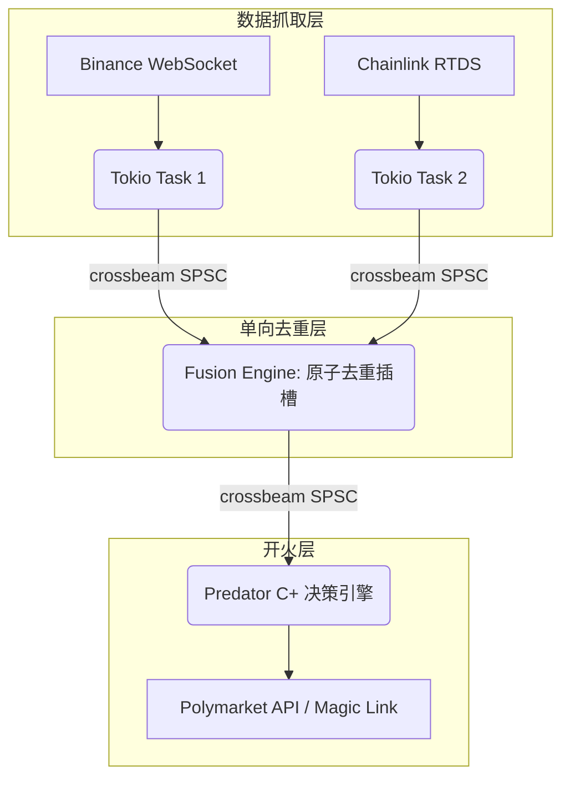

# PolyEdge Hyper-Mesh Architecture (v5.3/Omega-R3 Final)

*The definitive specification for the ultimate, extreme-low-latency market data fusion and execution engine.*

## 1. 核心哲学 (Core Philosophy)
在时间套利 (Latency Arbitrage) 的绞肉机里，所有的复杂抽象都是原罪。
Hyper-Mesh 架构不追求“大而全”，只追求一个目标：**将由光速决定的跨洋网络包，以绝对的零损耗、零竞争 (Zero-Contention)、零锁 (Lock-Free) 压入执行引擎的枪膛。**

Hyper-Mesh 彻底摒弃了传统的“事件总线 (Event Bus)”、“读写锁 (RwLock)”和“HashMap 全局去重”。在纳秒级的战役中，线程间的锁争用 (Contention) 会带来数毫秒的尾部抖动。Hyper-Mesh 将架构降维到了最底层的硬件层面。

## 2. 物理层解耦：单向数据激流 (Unidirectional Data River)
我们放弃了任何需要在不同线程间共享内存的双向通信。
整个架构被设计成了数条没有任何回流的瀑布：

### 2.1 Crossbeam SPSC (单生产者单消费者) 环形队列
在任何 `feed` 到 `fusion_engine`，再到 `engine_loop` (决策引擎) 的边界上，我们全部移除了原生的 `mpsc::channel` 和 `Mutex`。
取而代之的是 `crossbeam::channel` 的有界阵列队列 (ArrayQueue/SPSC)。
- **本质**：没有堆缓存分配，没有锁竞争。它只是在预先分配好的一块连续 L1 缓存上不断滚动指针。一端只管写，一端只管读，互不干扰，速度逼近 CPU 缓存线的硬件极限。

### 2.2 CPU 亲和力绑核 (Core Affinity)
我们调用了 Linux 底层的调度 API (`core_affinity`)。
- **采集核心** (`feed_runtime`) 被死死钉在了 **Core X** 上。
- **决策核心** (`strategy_engine`) 被死死钉在了 **Core Y** 上。
- 这两个线程永远不会发生系统级上下文切换 (Context Switch)。它们像两台物理上串联的高速马达，永远处于满负荷热机状态，避免了线程休眠唤醒带来的恐怖开销。

## 3. O(1) 原子时间墙 (Atomic Time Wall)
过去，当多个 Binance 和 Chainlink 的信号涌入时，系统需要维护一个庞大的 HashMap，还要涉及复杂的垃圾回收来去重旧数据。
**这是设计上的坏品味。**

在 Hyper-Mesh 中，我们彻底摧毁了 HashMap，取而代之的是 **Atomic State Slots**。
我们按市场/交易对预先分配了一组原生的 `AtomicU64`。
- 新的 Tick 到来时，只需将它的时间戳 (Source Timestamp) 与墙上的 `AtomicU64` 进行一次超低级的 CPU 硬件指令级别的 `.load(Ordering::Acquire)` 比较。
- 如果新时间戳 <= 现存时间戳，直接丢弃（连内存释放都不需要，因为它本来就分配在栈上）。
- 如果新时间戳 > 现存时间戳，使用 `.store(Ordering::Release)` 覆盖。
- **时间复杂度：绝对 O(1)**。从网络包解开，到判定数据是否有效，到进入决策引擎，中间**不涉及任何一次堆内存碎片分配**。

## 4. 零拷贝深绑：The Execution Intent V2
为了将反应时间压缩到 0.1 毫秒以下，我们改写了原有的交易组装流程。

1. **提前上膛**：在收到 Polymarket 最新的 `BookTop`（L2 行情）时，引擎会在**空闲时间**自动利用私钥和 EIP-712 对可能下达的买/卖方向分别进行预签名 (Pre-signing)。
2. **零延时开火**：当 Binance 的微爆动能越过了阈值，需要向 Polymarket 发出 FAK (Fill And Kill) 订单时，爱尔兰引擎**不再**现场组织 JSON 数据也不再执行任何耗时的加解密。它只是把早已装填好的 `OrderIntentV2` 订单包裹立刻抛向网卡。

## 5. 跨洋网络架构 (最终落地方案)
原定的 Phase 9 (1-byte UDP) 因状态极度残缺（丢弃了所有盘口深度、精确限价保护等）被否定。
Hyper-Mesh 最终的物理落地架构是**同体双机房**设计：

- **东京 (Tokyo - c6i.large)**: 作为观察哨。离 Binance 极近，全天候录屏，如果仅作数据验证或本地分析，它是世界级的雷达。
- **爱尔兰 (Ireland - c7i.xlarge)**: 真正的主轴。通过配置 `strategy.toml` 中的 `Predator C+` 等核心算法，这台机器：
  1. 通过 AWS 骨干网络，直连 Binance 的全球分发节点（获取信号）。
  2. 利用 Hyper-Mesh 架构，在 **3 毫秒内 (Parse 3.8ms)** 解析、过墙、触发决策。
  3. 因为它紧贴欧洲的 Polygon / Polymarket RPC 节点（网络延迟趋近 5~10ms），它能从完成决策的那个纳秒起，以最短的大气物理距离，闪电执行订单。

在这套架构下，一次全链路交易（从东方的数据波动到欧美的资金落袋），端到端的网络加系统延迟被死死封印在了 **130~135ms 之间**——在这个两万公里的通信跨度上，这就是物理学允许人类做到的极限。
